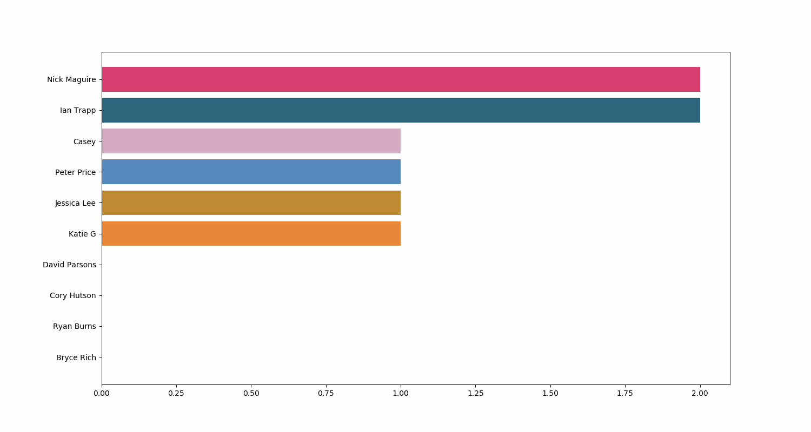

# Drink Analysis

Uses `matplotlib` $ `firestore-export` to run analysis on EAT Drink Data

Usage:
```bash
# Back Up & Analyze
# Requires Firebase Credentials in credentials/ & firestore-export installed via npm
# Requires Back Up File from firestore-export & required python imports installed
./run

# Back Up Only
# Requires Firebase Credentials in credentials/ & firestore-export installed via npm
./fetch_backup_data

# Analyze Only
# Requires Back Up File from firestore-export & required python imports installed
./analyze --file <path_to_backup_file>
```

Example Plot Race:


Example Bar Race:

